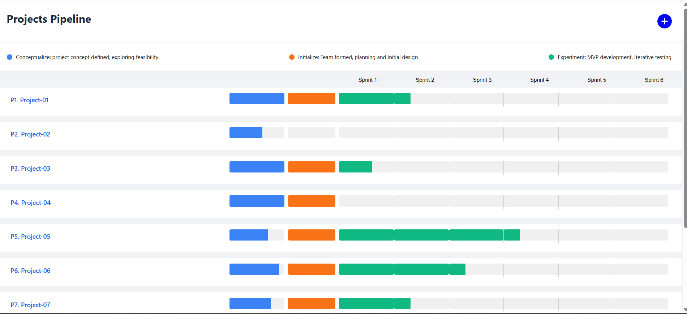
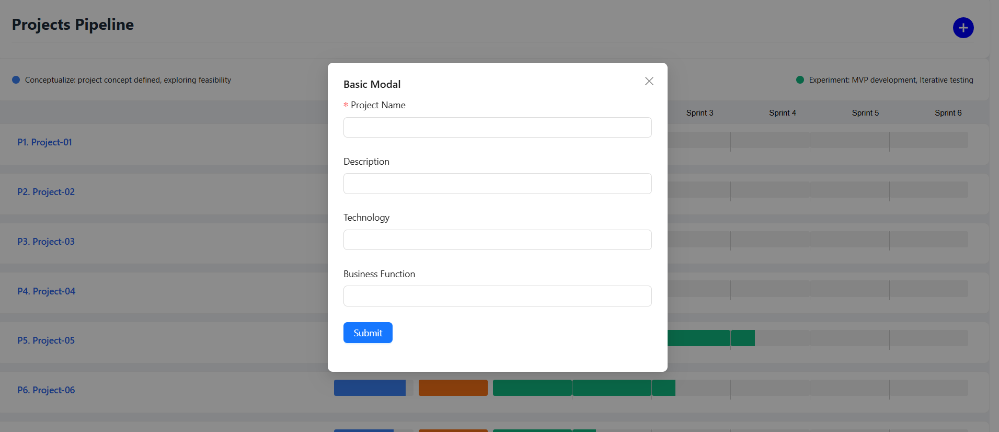
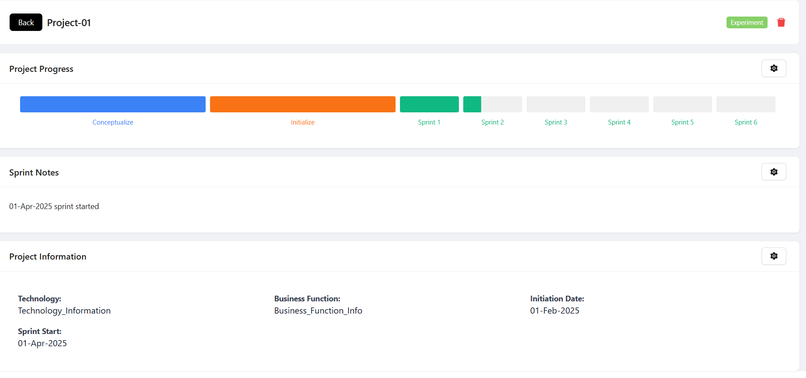
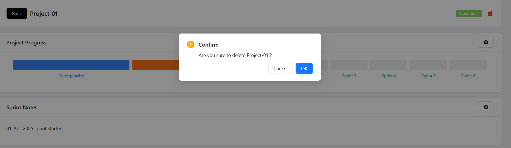

# Projex
Techstack:
==========================
React, vite, fastapi, python, postgresql

Redux: It can be implemented also, but for this small 2 page it felt like a drag, context themes can be implemented but didn't keep it as a priority
Next: next can be used but assignment was mentioned in pure react , so SSR didn't use.

Pending works:
========================
A lot of integration work is pending because of less time

Fallback:
==========================
If we don't connect to postgresql db, then there's a json file from where data ll be loaded

Start project:
============================
frontend:
    cd projex-fronend
    npm run dev

backend:
    cd projex-backend/app
    python main.py

api looks like below:
    curl --location --request GET 'http://localhost:8000/api/v1/projects'

Future works:
============================
Docker, github actions, terraform are future plans after completing all integration work

Back button works as expected, it moves data to history page.