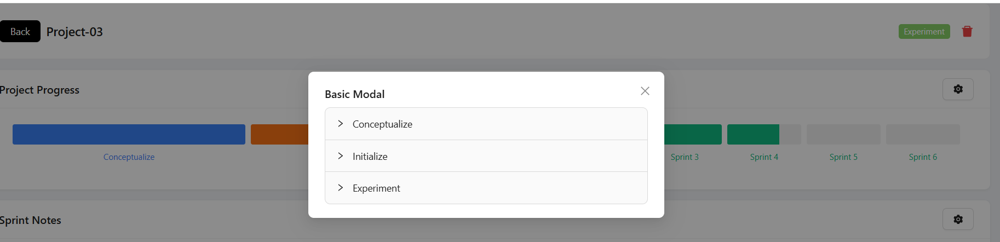

# Projex
Techstack:
==========================
React, vite, fastapi, python, postgresql

- **Redux:** It can be implemented also, but for this small 2 page it felt like a drag, context themes can be implemented but didn't keep it as a priority
- **Next:** next can be used but assignment was mentioned in pure react , so SSR didn't use.

Fallback:
==========================
If we don't connect to postgresql db, then there's a json file from where data ll be loaded

Completed Functionalities:
==========================
If we connect to db by starting backend:
- We can create new project (by clicking on + sign, but it will create bare minimum as that should be the appropriate behaviour). We should edit it to fill it up, but that was out of scope
- We can go back from details page
- We can delete a project from details page
- By clicking on edit button, edit modals open for some sections

Pending works:
========================
- Edit is purely pending, but frontend for edit/update is done to show what I was trying to do

Start project:
============================
**frontend:**
- cd projex-fronend
- npm run dev

**backend:**
- cd projex-backend/app
- python main.py

**api looks like below:**
- curl --location --request GET 'http://localhost:8000/api/v1/projects'

Future works:
============================
Docker, github actions, terraform are future plans after completing all integration work

